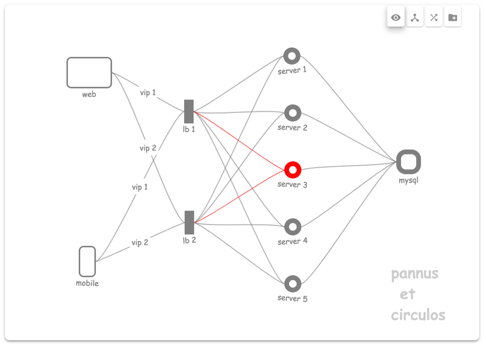

# Pannus et Circulos: *whiteboard as code*

Quickly sketching diagrams on black/whiteboards is a great way to understand and
explain complex systems. If we could digitize the experience, that knowledge
could be stored for future reference. Doing so would also allow easier colloboration
and extension.
These are the motivations behind *Pannus et Circulos* (cloth and circles):


Once digitized it is possible to make dynamic illustrations. E.g. in an emergency
instead of trying to visualize the mental model of a broken system, why not
automate chart updates:

    curl -X PATCH -d '{ "op": "add", "path": "/nodes/server-2/className", "value": "failed server" }' http://api-server/docs/$DOCID


Building on a simple API would allow knowledge to be programmed into the chart:

    curl -X PATCH -d '{ "op": "add", "path": "/edges/lb-1-server-3/className", "value": "red-edge" }' http://api-server/docs/$DOCID
    curl -X PATCH -d '{ "op": "add", "path": "/edges/lb-2-server-3/className", "value": "red-edge" }' http://api-server/docs/$DOCID



With a chart data model based on simple standards (css and json) accessed
simultaneously through a UI and API allowing the best of automated and human
input:

```json
{
  "nodes": {
    "server-1": {
      "id"   : "server-1",
      "label": "server 1",
      "x"    : 10,
      "y"    : 20
    },
    "mysql": {
      "id"       : "database-1",
      "label"    : "mysql",
      "className": "mysql",
      "x"        : 30,
      "y"        : 40
    }
  },
  "edges": {
    "server-1-mysql": {
      "id"       : "connection-1",
      "source"   : "server-1",
      "target"   : "database-1",
      "className": "red-edge"
    }
  },
  "style": {
    "nodes": {
      "mysql": {
        "backgroundColor": "#DDF",
        "borderColor"    : "#369",
        "borderRadius"   : "20px",
        "borderWidth"    : "10px",
        "height"         : "32px",
        "width"          : "32px"
      }
    },
    "edges": {
      "red-edge": {
        "paintStyle": {
          "stroke": "red"
        }
      }
    }
  }
}
```

## Quick Start

    git clone git@github.com:typingduck/petc.git
    cd petc
    npm install
    npm start  # this starts the UI/API server and DB.

* See [db/README.md](db/README.md#create-database) to setup initial database (just some tables to create).
* When ready the UI will be visible at [http://localhost:5000](http://localhost:5000/)

## Ports used

*  **DB**: 5002
* **API**: 5001
*  **UI**: 5000

## Code/Architecture

A React app, node API server and couchdb database. Uses socket.io websockets
to allow realtime collaboration/updates. Each of the components **db**, **server**,
**client** are self contained in their own directory.
See their respective directories for more details, running them independently, testing, etc.

## Status

Started as a prototype, but went better than expected. Having reached the intial
milestone, I consider it done pending a good reason to take it to the next level.
Would be nice to make the whiteboard-esque behaviour complete and productionize
the backend.

## Warning

This project currently uses *comic sans*, a font known to the State of
California to potentially cause seizures in individuals with prior sensitivity
to taste. But remember: Autoritätsdusel ist der größte Feind der Wahrheit.
